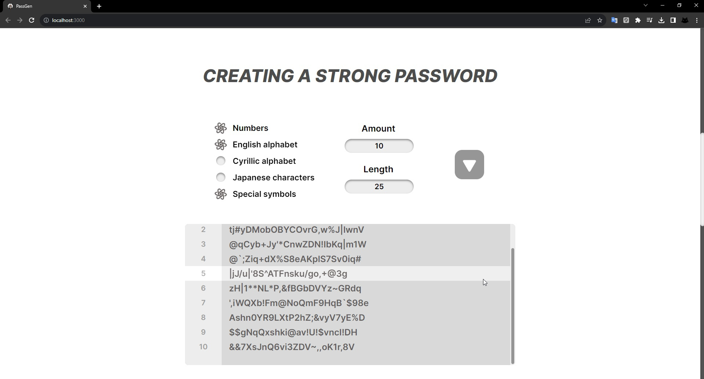
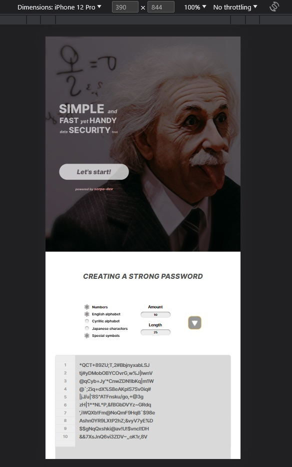

# Passwords Generator React Redux Toolkit

### Live Demo

- You can check it out by following **[this link](https://serpo-dev.github.io/passwords-generator-react-redux-toolkit)** 🔗 :

`https://serpo-dev.github.io/passwords-generator-react-redux-toolkit`

### Demo Screenshots

#### Desktop 🖥️

    
    
    
    

#### Mobile 📱

    
    

## Usage

1. Install deps:

`npm install`

2. Starting:

`npm run start`